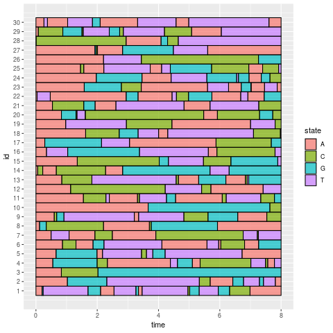
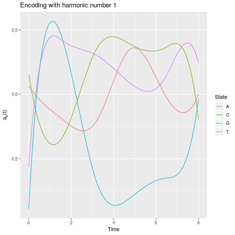

# cfda: Categorical Functional Data Analysis

[](https://travis-ci.com/modal-inria/cfda) [](https://ci.appveyor.com/project/Quentin62/cfda) [](https://codecov.io/gh/modal-inria/cfda) 

**cfda** provides functions for the analysis of categorical functional data. 

The main contribution is the computation of an optimal encoding (real functional variable) of each state of the categorical functional data.


## Installation

```
library(devtools)
install_github("modal-inria/cfda", build_vignettes = TRUE)
```

## Vignette

Once the package is installed, a vignette describing the mathematical background and showing an example is available using the R command:

```
RShowDoc("cfda", package = "cfda")
```

## Examples

``` 
library(cfda)

## generate dataset
set.seed(42)
# Simulate the Jukes-Cantor model of nucleotide replacement 
K <- 4
QJK <- matrix(1/3, nrow = K, ncol = K) - diag(rep(1/3, K))
lambda_QJK <- c(1, 1, 1, 1)
d_JK <- generate_Markov(n = 30, K = K, Q = QJK, lambda = lambda_QJK, Tmax = 10, labels = c("A", "C", "G", "T"))

# work on [0:8]
Tmax <- 8
d_JK2 <- cut_data(d_JK, Tmax = Tmax)


## visualization of the dataset
plotData(d_JK2)
```


```
## compute optimal encoding
# create basis object
m <- 8
b <- create.bspline.basis(c(0, Tmax), nbasis = m, norder = 4)

# compute encoding
encoding <- compute_optimal_encoding(d_JK2, b, nCores = 1)
 
# plot the encoding using the first harmonic
plot(encoding)
 
# extract the encoding using the first harmonic
encod <- get_encoding(encoding)

``` 




## Credits

**cfda** is developed by Cristian Preda (Inria Lille, Université de Lille) and Quentin Grimonprez (Inria Lille).

Copyrigth Inria - Université de Lille

## Licence

This program is free software: you can redistribute it and/or modify
it under the terms of the GNU Affero General Public License as
published by the Free Software Foundation, either version 3 of the
License, or (at your option) any later version.
This program is distributed in the hope that it will be useful,
but WITHOUT ANY WARRANTY; without even the implied warranty of
MERCHANTABILITY or FITNESS FOR A PARTICULAR PURPOSE.  See the
[GNU Affero General Public License](https://www.gnu.org/licenses/agpl-3.0.en.html) for more details.
